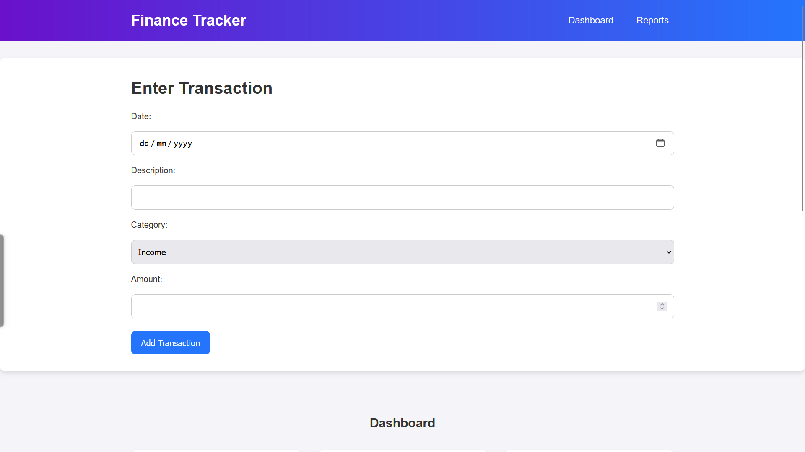

# Finance Tracker

A responsive web application that helps users track their income and expenses with visual charts and detailed reports.

## [Finance Tracker Live Demo](https://sainath-666.github.io/Finance_Tracker_1/)




## Features

- **Income & Expense Tracking**: Easily add and categorize your financial transactions
- **Visual Dashboard**: View your financial status with interactive pie charts
- **Detailed Reports**: Generate comprehensive transaction reports
- **Responsive Design**: Works perfectly on all devices - mobile, tablet, and desktop
- **Real-time Updates**: Dashboard updates instantly when new transactions are added

## Technologies Used

- **HTML5**: For semantic structure
- **CSS3**: For styling with responsive design principles
- **JavaScript**: For dynamic functionality and interactivity
- **Chart.js**: For creating interactive financial charts

## Installation

To view this project locally:

1. Clone the repository:
   ```bash
   git clone https://github.com/sainath-666/Finance_Tracker_1
   ```
2. Open `index.html` in your browser

## Usage

1. Navigate to different sections using the navbar
2. Add new transactions in the "Enter Transaction" section:
   - Enter date, description, category (income/expense), and amount
   - Click "Add Transaction" to record it
3. View your financial overview in the Dashboard section
4. Check detailed transaction history in the Reports section

## Responsive Design

The Finance Tracker is fully responsive and optimized for:
- Mobile phones (portrait and landscape)
- Tablets
- Desktop computers

Features like the collapsible navigation menu ensure a smooth experience on smaller screens.

## Browser Compatibility

Tested and working on all modern browsers:
- Chrome
- Firefox
- Safari
- Edge

## Connect With Me

[LinkedIn](https://www.linkedin.com/in/sainath666)

---
<div align="center">
  <p>Made with ❤️ by Sainathreddy</p>
</div>
